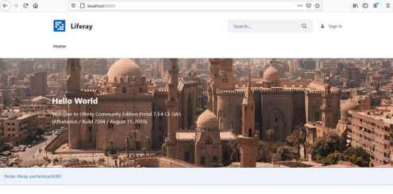
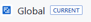
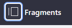
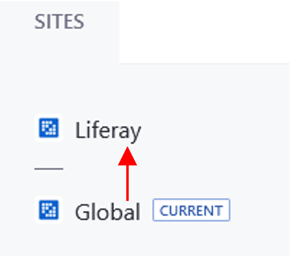

###   Step 3: Configuration and Installation of FIMS (1)

Once the Liferay platform has been hosted on Docker, the FIMS can be installed/restored. This requires the following four files:

- Global_No_Pages
- Roles_Admin
- Export_Docs
- Export_Pages_and_Content

1. Enter http://localhost:8080/ in a browser to see the application running.

This is what the output should be  

###   Part 3: Configuration and Installation of FIMS (2)

2. Sign in using username: test@liferay.com and password: test
3. On your first login to the system, you will be asked to confirm the Terms of Use, click ‘I agree’. On the following page you will be prompted to give a password reminder, enter something relevant. You will be redirected to the Liferay home page. 

**File 1: Global_No_Pages**

4. Select the Applications Menu button  and select Global.  
5. The page will automatically be redirected to the ‘Fragments’ Window. Click again on the applications menu button to confirm that the tag ‘Current’ appears.  
6. Select the control panel button  this will open the control panel navigation bar and select Publishing/Import.
7. Select <button name="button" style="background-color:#2697ed; border:none; font-size: large; color: white; padding:0.1% 1%; border-radius: 5px; vertical-align:middle;">+</button> and drag and drop the Global_No_Pages file into the dashed box. Wait for this to load and then select ‘Continue’.
8. On the following page, check the ‘Import Permissions’ and ‘Mirror with overwriting’ (Under Update Data) checkboxes and then select ‘Import’.

###   Part 3: Configuration and Installation of FIMS (3)

9. Return to the Application Menu  and select ‘Liferay’ --> 
10. Next the AntiSamy Sanitizer needs to be disabled. Go to the Application Menu/Control Panel/System Settings/ Security Tools/AntiSamy Sanitizer. Then deselect Enabled and select ‘Save’. 
11. As the next files are large, the servlet request size has to be increased. To do this go to the Application Menu/Control Panel/System Settings/Infrastructure/System Scope/Upload Servlet Request. Set the request size to 524288000 in the ‘Overall Maximum Upload Request Size Box’ and select ‘Update’.

**File 2 : Roles_Admin**

12.  Go to the Application Menu  and select Roles. Next click on the options button <button name="button" style="background-color:white; border:none; font-size: large; color: Black; padding:0.1% 1%; border-radius: 5px; vertical-align:middle;">&vellip;</button> and select ‘Export/Import’.
13. On the Import Tab, Drag and Drop the **Roles_Admin** file into the dashed window. 
14. Select ‘Continue’ and on the following page Select ‘Import’ at the bottom of the page (the default settings are suitable here)

###   Part 3: Configuration and Installation of FIMS (4)

**File 3: Export_Docs**

15. Return to the Application Menu and select Liferay again.
16. Open the control panel and navigate to Publishing/Import
17. Click <button name="button" style="background-color:#2697ed; border:none; font-size: large; color: white; padding:0.1% 1%; border-radius: 5px; vertical-align:middle;">+</button> and drag and drop the Export_Docs file into the dashed box. Wait for this to load and then select ‘Continue’.
18. On the following page, check the ‘Import Permissions’ and ‘Mirror with overwriting’ checkboxes and then select ‘Import’.  
19. Wait for the file to completely load then repeat the above Steps 16-18 for **File 4: Export_Pages_and_Content**.
20. Finally, the AntiSamy Sanitizer needs to be enabled again. Go to the Application Menu/Control Panel/System Settings/ Security Tools/AntiSamy Sanitizer. Then select Enabled and select ‘Save’. 
21. The FIMS system should now will be fully operational on the Docker as a locally hosted system. You can check this by opening a new browser window and entering http://localhost:8080/ 
