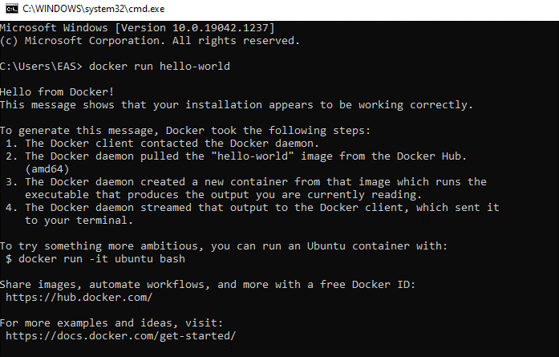
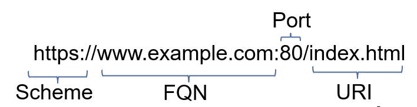

# FIMS Administrator Training Day 1

### Setup

1. Goto [hello_world](https://hub.docker.com/_/hello-world) to get started
   - This is just to check that docker is correctly installed and is operational 
2. Run Command Prompt (cmd). Win + R 
3. Run --> `docker pull hello-world` in the command line.
   
### Output

Below should be the same output you get.
  

## Rquiered files

1. Download and extract the zip folder from DropBox [here](https://www.dropbox.com/s/ktzmw04r2gssp30/AdminTraining.zip?dl=1)
2. Open `cmd` and navigate to the directory that you have just unzipped 

### FIMS Full System – End Goal 
 

