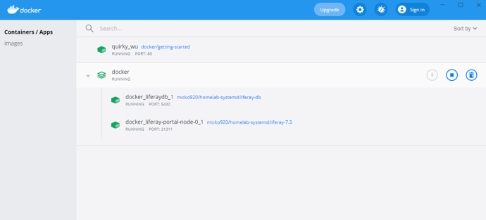

## Training 1
###   Step 1: Installing Docker
Installing Docker on a windows machine.
  

1. Follow the link [here](https://docs.docker.com/docker-for-windows/install/ ) to go to the docker website and download it.
2. Select Download from Docker hub and click on this button (this is a free download)   <button name="button" onclick="https://desktop.docker.com/win/main/amd64/Docker%20Desktop%20Installer.exe" style="background-color:#2697ed; border:none; color: #ffffff; padding:1%; border-radius: 5px;">Docker Download for Windows</button>  
3. Once the download has been completed open the installer and follow the prompts to completed the installation of Docker. Once installed you will be required to restart your computer before running the Docker software. 
  

Note: To run docker on Windows 10 Home, you must:

- be operating as the machine administrator user profile
- Have WSL2 Linux Kernel installed and updated [here](https://docs.microsoft.com/en-us/windows/wsl/install-win10)  

4. After the restart, open Docker Desktop. The Docker Whale Symbol should also appear in your bottom toolbar.

###   Step 2: Hosting Liferay – Docker Compose
The FIMS is operated on a software platform called Liferay. The next step is to host the Liferay platform through docker using Docker Compose 

**Familiarization with Docker Compose and Hosting of Liferay**

1. Open Docker Desktop and command prompt
2. Follow the instructions given on the following link to carry out an exercise to practice using [Docker Compose](https://docs.docker.com/compose/gettingstarted/#step-3-define-services-in-a-compose-file).

**Download Files from Drop Box**

1. Download the `docker-compose.yml` file, `Backup` and `Volumes` folder onto your local directory with the same directory structure as on the dropbox

**Hosting Liferay**

1. Open Docker Desktop
2. Open Command prompt and navigate to the directory (cd prompt) containing the saved files from step 1 (docker-compose, backup, volumes)
3. In command prompt, start the application by running `docker-compose up -d`
4. Goto [Local Host](http://localhost:8080/) in a browser to see the application running. At this stage this will show the Liferay platform home screen. Part 3 will explain how to install/restore the Forest Information Management System onto the Liferay platform.

###   Step 3: Configuration and Installation of FIMS

[**Configuration and Installation of FIMS**](../FIM/FIM.md)

###   Step 4: Adding New Users
[**Adding New Users**](../User.md)

###   Step 5: Accessing FIMS
**Access site from another computer on local LAN**

1. Enter IP address of the host computer into browser followed by port 8080. e.g 192.168.x.xx:8080 and confirm FIMS loads. This confirms the site is being hosted on the local LAN. 

###   Step 6: Ending Docker Session

1. Return to the docker interface and select the ‘Stop’ Button, or in the command prompt Ctrl + C or  `docker-compose stop` command.

