## Training 1

### Overview:

- https://hub.docker.com/_/hello-world

- This checks docker is correctly installed and operational 

- Running use command prompt. Windows key + R, cmd opens the command prompt

- Run in command line –>  `docker run hello-world`

 

## Session info:

- Download the example files in this directory of the Repo

 

### Docker; 1 - Run

 

1. Neccesary Commands
    - Pull
    - Image
    - Run

 

2. Process
   1. Open command prompt
   2. Change directory to directory where the zip file was extracted to (e.g docker-1-run) (cd)
   3. Type -> notepad.exe command.txt to open the command text file 
   4. Select first command line with mouse and copy 
   5. Paste into command prompt 
   6. Where a line starts with a # this is an instruction rather than a command e.g visit a browser and copy in the URL e.g [`localhost:5678`](https://localhost:5678)

 

3. Output
   1. Terminal Output  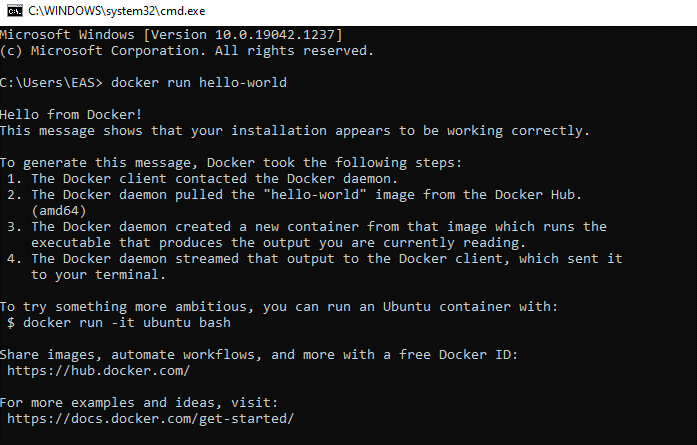
      
   2. Web Solution  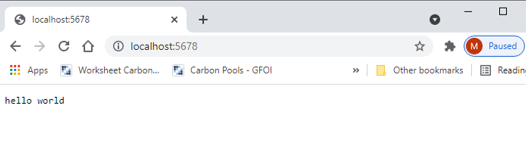

 

### Docker; 2 - Run + PS + Kill

 

1. Neccesary Commands
    - Run
      - Detach/interactive (-d/-it)
      - Ports - Publish/Expose
    - PS – lists instances that are running on the server
    - Kill – removes running image

  
[//]: # Add Lucid Chart image here
  

1. Process
   1. `docker docker run -d -p 5678:5678 hashicorp/http-echo -text="hello world"`  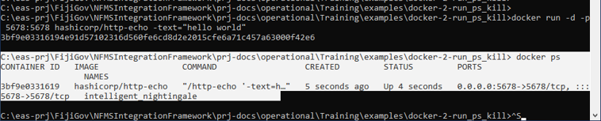

   2. `docker docker run -d -p 8765:5678 hashicorp/http-echo -text="hello world"`  docker ps  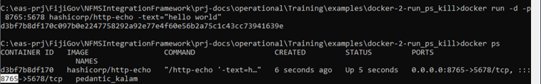

   3. `docker docker run -d -p 8888:5678 hashicorp/http-echo -text="hello world"`  

 

### Docker; 3 - Run + PS + Kill

 

1. Neccesary Commands
    - Run
      - Network

  
[//]: # Add Lucid Chart image here
  

1. Process
   1. `docker network create --driver=bridge --subnet=172.28.5.0/24 --ip-range=172.28.5.0/24 --gateway=172.28.5.254 mynet`
      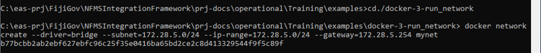  

   2. `docker run -d -p 5678:5678 --network=mynet --ip="172.28.5.2" hashicorp/http-echo -text="hello world A - Publish local port 5678“`
   3. `docker run -d -p 8888:5678 --network=mynet --ip="172.28.5.3" hashicorp/http-echo -text="hello world B - Redirect to public 8888“`
   4. `docker run -d --expose 5678 --network=mynet --ip="172.28.5.4" hashicorp/http-echo -text="hello world C - Exposed port 5678 only”`  `docker ps`  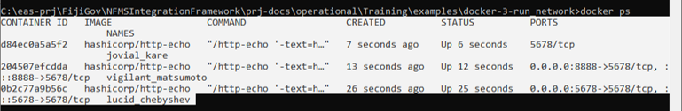  

   5. Exposed port accessed through external IP address  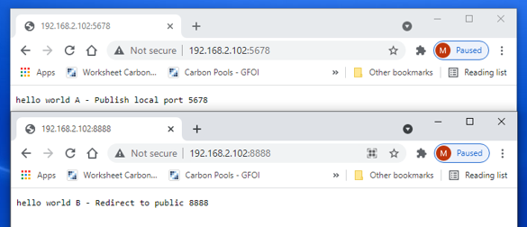

 

### Docker; 4 - Build

 

1. Neccesary Commands
    - Build

  
[//]: # Add Lucid Chart image here
  

1. Process
   1. `docker build -t php-hello-world`
   2. `docker image`
   3. `docker run -d -p 8888:80 php-hello-world`
   4. `docker ps`

Use your desired browser and enter [`localhost:8888`](https://localhost:8888) into the search bar

   5. `docker run -d -p 5678:5678 --network=mynet --ip="172.28.5.2" hashicorp/http-echo -text="hello world A - Publish local port 5678“`   `docker run -d -p 8888:5678 --network=mynet --ip="172.28.5.3" hashicorp/http-echo -text="hello world B - Redirect to public 8888“`   `docker run -d --expose 5678 --network=mynet --ip="172.28.5.4" hashicorp/http-echo -text="hello world C - Exposed port 5678 only”`  `docker ps`    

2. Output  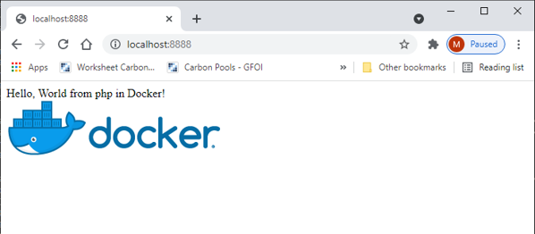

 

### Compose; 1 - Compose + Up

 

1. Neccesary Commands
    - Up
    - Down
    - Start
    - Stop

  
[//]: # Add Lucid Chart image here
  

1. Process
   1. `docker-compose up -d`
   2. `docker ps`  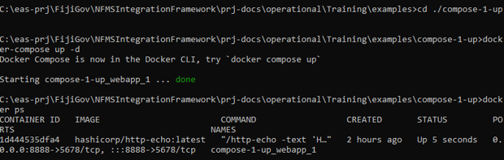  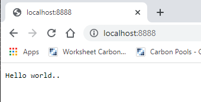
   3. Browse [`localhost:8888`](https://localhost:8888)

   4. Now up, start, stop, stop  `docker-compose up -d`  
   5. `docker ps`
   6. `docker-compose start`
   7. `docker ps`
   8. `docker-compose down`
   9. `docker ps`   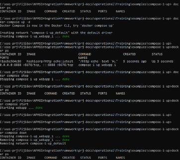[//]: # Re do image

 

### Compose; 2 - Compose + Build

 

1. Neccesary Commands
    - Up
    - Down
    - Start
    - Stop
    - Build

  
[//]: # Add Lucid Chart image here
  

1. Process
   1. `docker-compose build`
   2. `docker-compose up -d`
   3. Browse [`localhost:8888`](https://localhost:8888) Notice there is no "down"  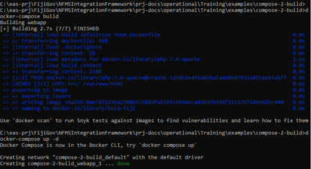[//]: # Re do image  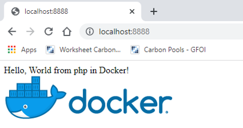  
   4. Change the content in bula-fiji/src/index.php to;
   5. `3: echo "Hello, World from php in Docker! ";`
   6. `3: echo "Bula Fiji from php in Docker! ";`
   7. Browse [`localhost:8888`](https://localhost:8888)  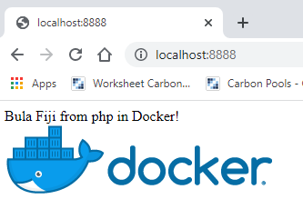

 

### Compose; 3 - Compose + Network

 

1. Neccesary Commands
    - Up
    - Down
    - Start
    - Stop

  
[//]: # Add Lucid Chart image here
  

1. Process
   1. `docker-compose up -d`
   2. `docker ps`
   3. Browse (A) [`localhost:5678`](https://localhost:5678)  Browse (B) [`localhost:8888`](https://localhost:8888)  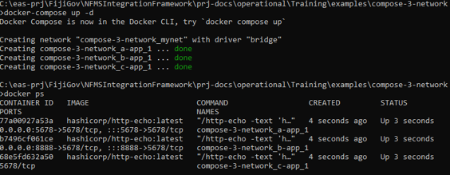  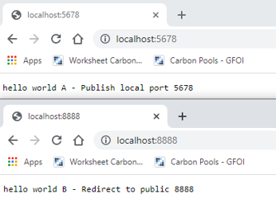  
   4. Now open these ports in someone elses browser  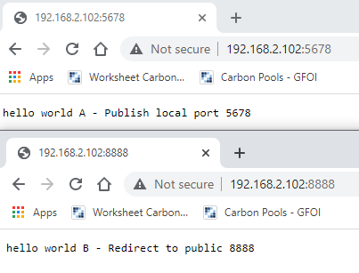

 

### Compose; 4 - Compose + Volume

 

1. Neccesary Commands
    - Up
    - Down
    - Start
    - Stop
    - Build

  
[//]: # Add Lucid Chart image here
  

1. Process
   1. `docker-compose build`
   2. `docker-compose up -d`
   3. [`localhost:8888`](https://localhost:8888)  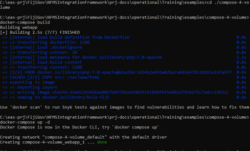  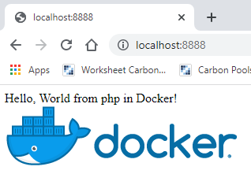  
   4. Change the content in volumes/bula-fiji-node/index.php to;
   5. `3: echo "Hello, World from php in Docker! ";`  `3: echo "Bula Fiji from php in Docker! ";`  There is no need to rebuild
   6. [`localhost:8888`](https://localhost:8888)  

 

### Compose; 1 - Skeleton System

 

1. Neccesary Commands
    - Run
      - Network

  
[//]: # Add Lucid Chart image here
  

1. Process
   1. `docker-compose build`
   2. `docker-compose up -d`
   3. [`localhost:8888`](https://localhost:8888)
   4.       
   5. Change the content in volumes/bula-fiji-node/index.php to;
   6. `3: echo "Hello, World from php in Docker! ";`  `3: echo "Bula Fiji from php in Docker! ";`  There is no need to rebuild
   7. [`localhost:8888`](https://localhost:8888)  

 

### Terminology

 

1. Proxy
    - Rev Proxy
    - Switch (Name/IP/Portal)
    - SSL
2. Images
    - Postgresql
    - Liferay
    - Caddy
    - Shiny Proxy
    - Hello World
    - Http Echo

 

### Skeleton System

 

[//]: # Add Lucid Chart image here

1. Images
    - Postgresql
    - Liferay
    - Shiny Proxy
      - Rimages

 

### Traffic Routing (inc Liferay)

 

  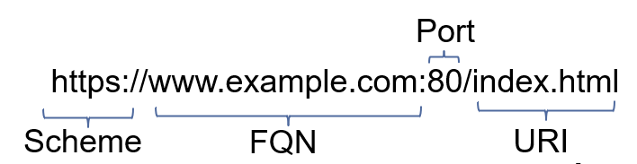
[//]: # Add Lucid Chart image here

 

### Traffic Routing (Full Complexity)

 

[//]: # Add Lucid Chart image here

 