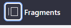
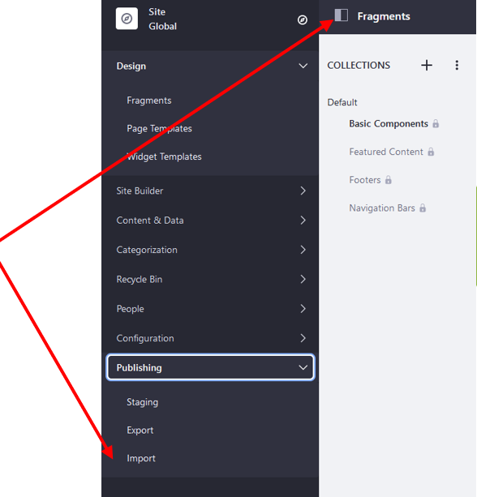

## Training 2
###   Step 1: Installing Docker
Installing Docker on a windows machine [here](../README.md).

###   Part 2: Hosting Liferay – Familiarization with Docker Compose

The FIMS is operated on a software platform called Liferay. The next step is to host the Liferay platform through docker using Docker Compose. Docker Compose is an application which is pre-installed on the Docker Desktop Program that allows multiple containers to be run as a single service/virtual image. (More on Docker Compose can be found [here](https://docs.docker.com/compose/))  

**Familiarization with Docker Compose and Hosting of Liferay** 
1. Open both Docker Desktop and Command Prompt. The Docker Desktop program on Windows uses Command Prompt as its controller so it has to be used to operate the program.

2. Follow the instructions given on the following link to carry out an exercise to practice using [Docker Compose](https://docs.docker.com/compose/gettingstarted/#step-3-define-services-in-a-compose-file). 

###   Part 2: Hosting Liferay – Downloading Files

**Download Files from Drop Box**
1. Follow this [link](https://www.dropbox.com/sh/wzhq046z2ieu0mg/AACfANue5b1QSHXKgOtUw1x_a?dl=0) to the Fiji NFMS Directory then sign into drop box

2. Select the two folders (Volumes and backup-20210314) and docker-compose.yml by clicking on their check boxes. Then select ‘Download’. This will download all the files as a ZIP file. You do not need to download this Powerpoint presentation again if you already have it saved. ***(Note: if the Download button does not show, try navigating out of the FIJI-NFMS folder by selecting ‘Dropbox>’ and then returning to the folder by double clicking on the folder FIJI NFMS from your dropbox homepage)***

<!--Add 2 images here-->

###   Part 2: Hosting Liferay – Run Docker Compose

3. Once downloaded, locate the ZIP file from your browser downloads and right-click then select ‘extract all’. Choose a location in your computer directory (using Browse) then select ‘Extract’ to extract the files.  

4. Once the files are downloaded and extracted from the .zip file you should have them saved in a structure looking like this. Make a note of the directory where the files are saved as this is needed for the next step. You can then start progressing to the next step (Hosting Liferay)

<!--Add 1 images here-->

###   Part 2: Hosting Liferay – Run Docker Compose (2)

**Hosting Liferay**
1. Open Docker Desktop and Command Prompt
2. On your file browser navigate to the directory containing the files, click on the address bar and copy (ctrl + C) the directory location

3. In Command Prompt write ‘cd’ then paste the directory location and press Enter. This will change the directory

<!--Add 2 images here-->

###   Part 2: Hosting Liferay – Run Docker Compose (3)

4. In Command Prompt, start the application by typing docker-compose up –d

Docker will start loading the docker-compose.yml file and setting up the docker image. This may take some time. When complete you will see the following text in Command Prompt. 

5. Copy this address: http://localhost:8080/ into a web browser to see the application running. At this stage this will show the Liferay platform home screen. Part 3 will explain how to install/restore the Forest Information Management System onto the Liferay platform.

<!--Add 2 images here-->

###   Part 3: Configuration and Installation of FIMS

Once the Liferay platform has been hosted on Docker, the FIMS can be installed/restored. This requires the following four files these are all stored in the ‘backup’ folder.
- Global_No_Pages
- Roles_Admin
- Export_Docs
- Export_Pages_and_Content

<!--Add 1 images here-->

1. Enter http://localhost:8080/ in a browser to see the liferay image running. 
  

###   Part 3: Configuration and Installation of FIMS (2)

2. Sign in using username: test@liferay.com and password: test
3. On your first login to the system, you will be asked to confirm the Terms of Use, click ‘I agree’. On the following page you will be prompted to give a password reminder, enter something relevant. You will be redirected to the Liferay home page. 

**File 1: Global_No_Pages**

4. Select the Applications Menu button  and select Global. 
The page will automatically be redirected to the ‘Fragments’ page. Click again on the applications menu button to confirm that the tag ‘Current’ appears next to Global.  Click X to return.  

5. Select the control panel button  this will open the control panel navigation bar and select Publishing > Import.  

6. Select <button name="button" style="background-color:#2697ed; border:none; font-size: large; color: white; padding:0.1% 1%; border-radius: 5px; vertical-align:middle;">+</button> and drag and drop the *Global_No_Pages* file from the ***backup*** Folder into the dashed box. Wait for this to load and then select ‘Continue’. 

7. On the following page, check the ‘Import Permissions’ and ‘Mirror with overwriting’ (Under Update Data) checkboxes and then select ‘Import’.  

###  
###  
###  
###  
###  
###  
###  
###  