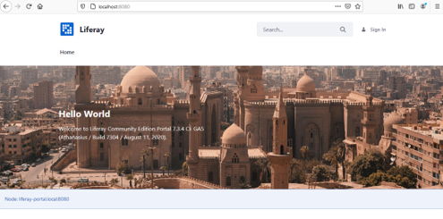

## Training 2

###   Step 1: Installing Docker

Installing Docker on a windows machine [here](../README.md#install).

###   Part 2: Hosting Liferay – Familiarization with Docker Compose

The FIMS is operated on a software platform called Liferay. The next step is to host the Liferay platform through docker using Docker Compose. Docker Compose is an application which is pre-installed on the Docker Desktop Program that allows multiple containers to be run as a single service/virtual image. (More on Docker Compose can be found [here](https://docs.docker.com/compose/))

**Familiarization with Docker Compose and Hosting of Liferay**

1. Open both Docker Desktop and Command Prompt. The Docker Desktop program on Windows uses Command Prompt as its controller so it has to be used to operate the program.

2. Follow the instructions given on the following link to carry out an exercise to practice using [Docker Compose](https://docs.docker.com/compose/gettingstarted/#step-3-define-services-in-a-compose-file).

###   Part 2: Hosting Liferay – Downloading Files

**Download Files from Drop Box**

1. Follow this [link](https://www.dropbox.com/sh/wzhq046z2ieu0mg/AACfANue5b1QSHXKgOtUw1x_a?dl=0) to the Fiji NFMS Directory then sign into drop box

2. Select the two folders (Volumes and backup-20210314) and docker-compose.yml by clicking on their check boxes. Then select ‘Download’. This will download all the files as a ZIP file. You do not need to download this Powerpoint presentation again if you already have it saved. **_(Note: if the Download button does not show, try navigating out of the FIJI-NFMS folder by selecting ‘Dropbox>’ and then returning to the folder by double clicking on the folder FIJI NFMS from your dropbox homepage)_**

###   Part 2: Hosting Liferay – Run Docker Compose

3. Once downloaded, locate the ZIP file from your browser downloads and right-click then select ‘extract all’. Choose a location in your computer directory (using Browse) then select ‘Extract’ to extract the files.

4. Once the files are downloaded and extracted from the .zip file you should have them saved in a structure looking like this. Make a note of the directory where the files are saved as this is needed for the next step. You can then start progressing to the next step (Hosting Liferay)

###   Part 2: Hosting Liferay – Run Docker Compose (2)

**Hosting Liferay**

1. Open Docker Desktop and Command Prompt
2. On your file browser navigate to the directory containing the files, click on the address bar and copy (ctrl + C) the directory location

3. In Command Prompt write ‘cd’ then paste the directory location and press Enter. This will change the directory

###   Part 2: Hosting Liferay – Run Docker Compose (3)

4. In Command Prompt, start the application by typing docker-compose up –d
    
   Docker will start loading the docker-compose.yml file and setting up the docker image. This may take some time. When complete you will see the following text in Command Prompt.

5. Copy this address: http://localhost:8080/ into a web browser to see the application running. At this stage this will show the Liferay platform home screen. Part 3 will explain how to install/restore the Forest Information Management System onto the Liferay platform.  
   

###   Part 3: Configuration and Installation of FIMS

Once the Liferay platform has been hosted on Docker, the FIMS can be installed/restored. This requires the following four files these are all stored in the ‘backup’ folder.

- Global_No_Pages
- Roles_Admin
- Export_Docs
- Export_Pages_and_Content

1. Enter http://localhost:8080/ in a browser to see the liferay image running.
     

###   Part 3: Configuration and Installation of FIMS (2)

2. Sign in using username: test@liferay.com and password: test
3. On your first login to the system, you will be asked to confirm the Terms of Use, click ‘I agree’. On the following page you will be prompted to give a password reminder, enter something relevant. You will be redirected to the Liferay home page.

**File 1: Global_No_Pages**

4. Select the Applications Menu button  and select Global.
   The page will automatically be redirected to the ‘Fragments’ page. Click again on the applications menu button to confirm that the tag ‘Current’ appears next to Global.  Click X to return.

5. Select the control panel button  this will open the control panel navigation bar and select Publishing > Import.  

6. Select <button name="button" style="background-color:#2697ed; border:none; font-size: large; color: white; padding:0.1% 1%; border-radius: 5px; vertical-align:middle;">+</button> and drag and drop the _Global_No_Pages_ file from the **_backup_** Folder into the dashed box. Wait for this to load and then select ‘Continue’.

7. On the following page, check the ‘Import Permissions’ and ‘Mirror with overwriting’ (Under Update Data) checkboxes and then select ‘Import’.

###   Part 3: Configuration and Installation of FIMS (3)

9. Return to the Application Menu  and select ‘Liferay’
10. Next the AntiSamy Sanitizer needs to be disabled. Go to the Application Menu > Control Panel > System Settings > Security Tools > AntiSamy Sanitizer. Then deselect Enabled and select ‘Update’.
11. As the next files are large, the servlet request size has to be increased. To do this go to the Application Menu > Control Panel > System Settings > Infrastructure > System Scope > Upload Servlet Request. Set the request size to 524288000 in the ‘Overall Maximum Upload Request Size Box’ and select ‘Save’.

**File 2 : Roles_Admin**

12. Go to the Application Menu  > Control Panel and select Roles. Next click on the <button name="button" style="background-color:white; border:none; font-size: large; color: Black; padding:0.1% 1%; border-radius: 5px; vertical-align:middle;">&vellip;</button> options button and select ‘Export/Import’.
13. On the Import Tab, Drag and Drop the **Roles_Admin** file into the dashed window.
14. Select ‘Continue’ and on the following page Select ‘Import’ at the bottom of the page (the default settings are suitable here). When uploaded a ‘Successful’ note will appear. You can then exit the window.

###   Part 3: Configuration and Installation of FIMS (4)   

**File 3: Export_Docs**

15. Return to the Application Menu and select Liferay again.
16. Open the Control Panel  and navigate to Publishing>Import
17. Click <button name="button" style="background-color:#2697ed; border:none; font-size: large; color: white; padding:0.1% 1%; border-radius: 5px; vertical-align:middle;">+</button> and drag and drop the **Export_Docs** file into the dashed box. Wait for this to load and then select ‘Continue’.
18. On the following page, check the ‘Import Permissions’ and ‘Mirror with overwriting’ checkboxes and then select ‘Import’.
19. Wait for the file to completely load then repeat the above Steps 17-18 for **File 4: Export_Pages_and_Content**.
20. Finally, the AntiSamy Sanitizer needs to be enabled again. Go to the Application Menu > Control Panel > System Settings > Security Tools > AntiSamy Sanitizer. Then check the ‘Enabled’ box and select ‘Update’.

###   Part 3: Configuration and Installation of FIMS (5)

21. The FIMS system should now will be fully operational on the Docker as a locally hosted system. You can check this by opening a new browser window and entering [Local Host](http://localhost:8080/)

###   Part 4: Adding New Users   

**Adding a New User**

Three new users need to be added to allow the full operation and administration of the FIMS.

- Fims User – this is a general user and multiple accounts should be made with these settings for different personnel who will be using the system.
- Fims Admin
- Fims Super

  

1. Before adding the new users, first disable email verification. Go to the Application Menu  Control Panel > Instance Settings > User Authentication > General and **deselect** the ‘Require strangers to verify their email address?’ Check box.
2. Click ‘Save’ to save the new settings

###   Part 4: Adding New Users (2)   

**FIMS User (General user)**

1. Go to the Application Menu  then select Control Panel > Users and Organizations
2. Click on the <button name="button" style="background-color:#2697ed; border:none; font-size: large; color: white; padding:0.1% 1%; border-radius: 5px; vertical-align:middle;">+</button> and enter the required fields: Screen Name, Email and First and Last name fimsuser, fimsuser@enviroaccounts.com, FIMS USER. Select ‘Save’.
3. On the ‘User and Organizations’ Page, select the option button  next to the user name and select ‘Edit’
4. On the Membership Tab, under ‘Sites’ click ‘Select’ and click ‘Liferay’. Then click ‘Save’.
5. On the Roles tab under ‘Site Roles’ click ‘Select’ and choose ‘Fiji Staff’. Then click ‘Save’.
6. On the Password tab set a new password for the user. (Note: the User will be prompted to update the password on their first login to the system).
7. Log out of the Test@Liferay User and Login with the new user credentials to test the process.
8. On first Login you will be required to agree to terms and conditions and change the password.

**FIMS Admin**

9. Repeat steps 1-7 to create an admin account but instead use the following details and roles:

| Details                      | Regular Roles   | Site Roles             |
| ---------------------------- | --------------- | ---------------------- |
| Fiji Admin                   | Fiji User Admin | Fiji Staff             |
| Fijiadmin(screen name)       |                 | Fiji Document Admin    |
| Fijiadmin@enviroaccounts.com |                 | Fiji Page Admin        |
|                              |                 | Fiji Tag Admin         |
|                              |                 | Fiji Web Content Admin |

###   Part 4: Adding New Users (3)

**FIMS Super**

9. Repeat steps 1-7 to create an Super admin account but instead use the following roles and no Memberships (i.e skipping step 4):

| Regular Roles   | Site Roles |
| --------------- | ---------- |
| Administator    | N/A        |
| Fiji User Admin |            |

10. Once all the new users are added, you should login once again as the test@liferay.com user and change the password from the original password ‘test’ to make the test@liferay.com account more secure.

Instructions for doing this can be found here: https://learn.liferay.com/commerce/2.x/en/starting-a-store/introduction-to-the-admin-account.html#configuring-the-admin-user

###   Part 5: Accessing FIMS

Access site from another computer on local LAN

1. Enter IP address of the host computer into browser followed by port 8080. e.g 192.168.x.xx:8080 and confirm FIMS loads. This confirms the site is being hosted on the local LAN.

###   Part 6: Ending Docker Session

1. Return to the docker interface and select the ‘Stop’ Button, or in the Command Prompt Ctrl + C or docker-compose stop command.

The image can be re-run again at any time by selecting the Start Button.

