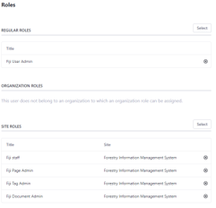

###   Step 4: Adding New Users (1)
**Adding a New Users**
Three new users need to be added to allow the full operation and administration of the FIMS. 
- Fims User – this is a general user and multiple accounts should be made with these settings for different personnel who will be using the system. 
- Fims Admin
- Fims Super

1. Before adding the new users, first disable email verification. Go to the Application Menu  Control Panel / Instance Settings /User Authentication/General and deselect the ‘Require strangers to verify their email address?’ Check box. 
2. Click ‘Save’ to save the new settings

###   Part 4: Adding New Users (2)

**FIMS User (General user)**
1. Go to the Application Menu  then select ‘Users and Organizations’
2. Click on the <button name="button" style="background-color:#2697ed; border:none; font-size: large; color: white; padding:0.1% 1%; border-radius: 5px; vertical-align:middle;">+</button> and enter the required fields. e.g fimsuser and fimsusers@enviroaccounts.com. Select ‘Save’. 
3. On the ‘User and Organizations’ Page, select the option button <button name="button" style="background-color:white; border:none; font-size: large; color: Black; padding:0.1% 1%; border-radius: 5px; vertical-align:middle;">&vellip;</button> next to the user name and select ‘Edit’
4. On the Membership Tab, under ‘Sites’ click ‘Select’ and click ‘Liferay’. 
5. On the Roles tab under ‘Site Roles’ click ‘Select’ and ‘Choose’ Fiji Staff.
6. On the Password tab set a new password for the user. (Note: the User will be prompted to update the password on their first login to the system). 
7. Log out of the Test@Liferay User and Login with the new user credentials to test the process. 

**FIMS Admin**
8. Repeat steps 1-7 for the General User to create an admin account but instead use the following roles:

| Regular Roles | Site Roles |
| ----------- | ----------- |
| Fiji User Admin | Fiji Staff |
|  | Fiji Document Admin |
|  | Fiji Page Admin |
|  | Fiji Tag Admin |
|  | Fiji web Content Admin |

###   Part 4: Adding New Users (3)

**FIMS Super**

9. Repeat steps 1-7 for the General User to create an Super admin account but instead use the following roles and no Memberships (i.e skipping step 4):

| Regular Roles | Site Roles |
| ----------- | ----------- |
| Administrator | N/A |
| Fiji User Admin |  |

1.  Once all the new users are added, you should login once again as the test@liferay.com user and change the password to make the test account more secure.
 
Instructions for doing this can be found [here](https://learn.liferay.com/commerce/2.x/en/starting-a-store/introduction-to-the-admin-account.html#configuring-the-admin-user )
